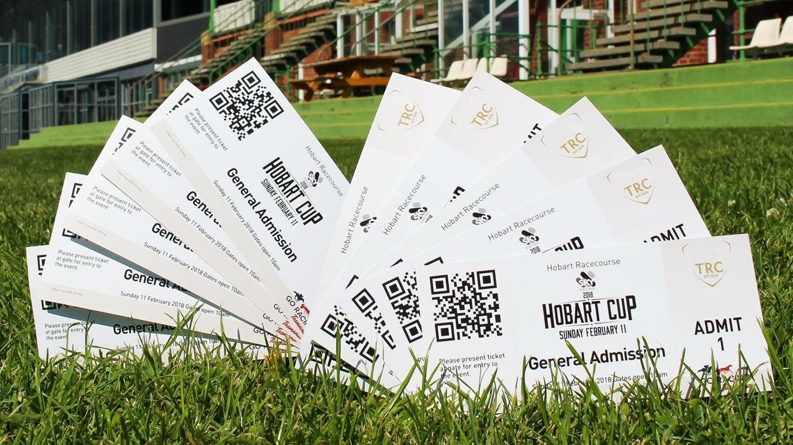
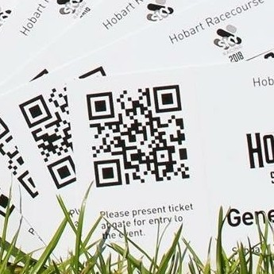
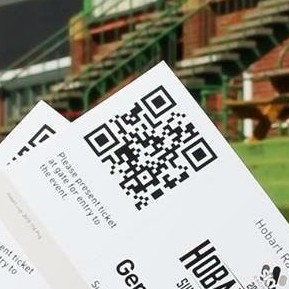

# Don't Expose Your QR Codes

Does that title rhyme? whatever...

On the 16th of January, the Tasmanian Racing Club Inc made a post on their official facebook page about giving away 10 tickets to the upcoming Hobart cup. That post contained the above photo in which two of the ten tickets have their QR codes showing... *ohno.jpg*

Putting photos of real tickets in photos is always bad, but this was extra bad.

## Looking Deeper

At first I thought that the QR code on the ticket might just be a link to their website. It wasn't, it was the unique identifier of that ticket. Well at least the unique id is random and so only those tickets can be stolen... right? Nope, it was sequential.

The QR code of the front ticket reads "hobart-cup-2018-151" and the sixth reads "hobart-cup-2018-156". You can get your phone out an see for yourself.

## Free Tickets For All!

Okay so don't actually do this because that is bad and illegal. This is just me explaining how a criminal may undergo making tickets that would be valid.

If you did want to get a free ticket, you wouldn't need anything more than a phone. Got to any QR code generator website, put hobart-cup-2018-[any number above 150 here] into it and boom, you can scan that at the door to get in.

## Solutions

The solution to this problem really isn't that hard. Instead of using a sequential id at the end of the qr code, just use some random string of maybe 10 digits which would make it near impossible to guess the code of any other ticket. The people making these tickets were obiously just not thinking about security which is a dangerous thing to do.

## Further research

If anyone wants to send me photos of their tickets so I can do some further research, me email is kinneliam@gmail.com. Do note that sending your tickets to third parties is probably against the terms and agreements that you accepted when you bought it, so maybe wait until after the race day.