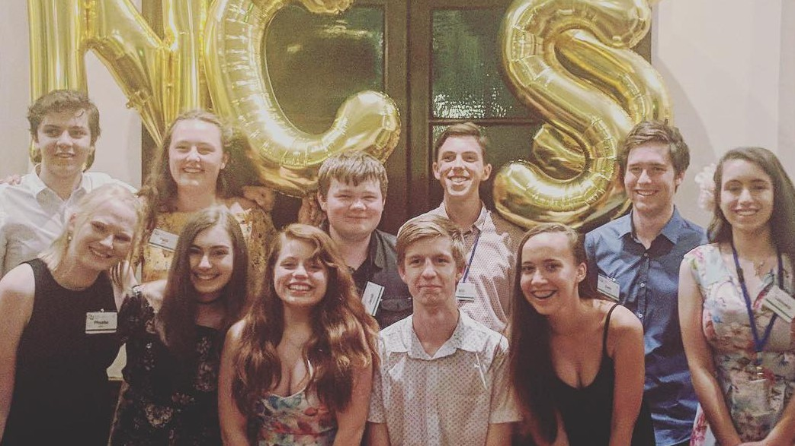

From January 5th to 15th I attended NCSS 2018 and had the most fun I've ever had. As well as meeting over 130 nerds, I got to do lots of [embedded Python](https://github.com/liamkinne/ncss-2018), design a CPU from the ground up (as well as [simulate it in python](https://github.com/liamkinne/cpld-cpu)) and become well acquainted with the BBC micro:bit.

Something that sets NCSS apart from anything else I've ever done is the direct links that it has to industry. We spent one of the days going on site visits to all of the sponsors, which was inspiring to say the least. If you find me working at one of those companies in the future, don't be surprised. I even got to do a (mock) interview at Google which actually turned out to be a lot more fun than I would have expected.

At the start of this year I had the thought that I was living the life that I had dreamt of as a kid, but going to NCSS has changed that. I have had so many opportunities that I could never have imagined when I was younger and I can't wait for what the future has to hold.